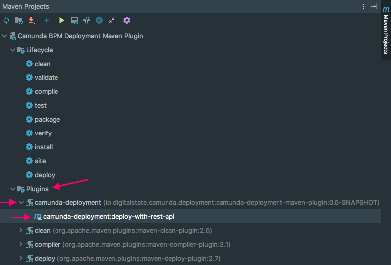

# Camunda BPM Deployment Maven Plugin

A Maven plugin that provides the ability to deploy to a Camunda BPM
instance through the Camunda Rest API.

The plugin is designed to be used along side unit testing, allowing
the Build-Test-Deploy flows to easily occur.


## How it works

When the plugin is executed, a groovy script is executed,
which will pull in any additional dependencies through Grape,
and then execute the script.
All plugin parameter configurations are passed into the script through
a binding with the variable name `configs`.

Within the Groovy script you can access the `configs` Map with:

```groovy
Map<String, Object> config = (Map<String, Object>)configs

println config.host // outputs: http://localhost:8080
```

See [CamundaDeployment.groovy](./src/main/resources/io/digitalstate/camunda/deployment/CamundaDeployment.groovy) for a working example.

## Using the Plugin

The plugin can be activated directly throuhg the command line and
will also be picked up by Maven UIs such as the one built
into IntelliJ IDEA.

### Command Line

`mvn camunda-deployment:deploy-with-rest-api`

### IntelliJ IDEA

With your Maven project loaded in IntelliJ, go to:

1. Maven Projects tab
1. Open the specific Maven Project
1. Plugins
1. Click the arrow to the left of `camunda-deployment`
1. Double click `camunda-deployment:deploy-with-rest-api`
1. The build/deployment will run



## Build Status

The plugin will detect if a `Exception` object is returned by the
evaluated Groovy script, and throw a Plugin Build Failure causing
a `BUILD FAILURE` to be returned.

The default groovy script will detect the http status-code returned
by Camunda.  The script expects Camunda to return a status code
of `200`, otherwise a Exception will be thrown.

# How to Install

The plugin is located at http://github.com/stephenott/camunda-deployment-maven-plugin as a release.

You can easily install the plugin by adding the following to your maven pom.xml file:

```xml
<project>
...
    <pluginRepositories>
        <pluginRepository>
            <id>jitpack.io</id>
            <url>https://jitpack.io</url>
        </pluginRepository>
    </pluginRepositories>
...
```
This snippet will enable Maven dependency download
directly from Github.com

If you already have a `<pluginRepositories>` section in your pom.xml,
then just add the `<pluginRepository>` section.

Once this section is added, you can add the plugin configuration
section in the `<build><plugins>` section as described in
the [Plugin Configuration](#plugin-configuration) section.

If you are using IntelliJ, you can enable the
"Auto-download dependencies" feature, which will automatically
add the missing dependencies described.


# Plugin Configuration

The maven plugin provides multiple configuration options.

```xml
    <build>
        <plugins>
            <plugin>
                <groupId>com.github.StephenOTT</groupId>
                <artifactId>camunda-deployment-maven-plugin</artifactId>
                <version>v0.5</version>
                <configuration>
                    <host>http://localhost:8081</host>
                    <apiPath>/engine-rest</apiPath>
                    <deploymentFilesDir>${project.build.directory}/deploymentFiles</deploymentFilesDir>
                    <scriptPath>scripts/myScript.groovy</scriptPath>  <!-- Path is relative to pom.xml unless full path is provided-->
                    <additionalConfigs>
                    <someKey>value goes here</someKey>
                    <key2>value goes here</key2>
                    </additionalConfigs>
                </configuration>
            </plugin>
        </plugins>
    </build>
```

All values in teh `<configuration>` section are optional.

Default values:

| Parameter | Value |
| ----------------- | ------------- |
host | `http://localhost:8080`
apiPath | `/engine-rest`
deploymentFilesDir | `${project.build.directory}/camunda-deployment-files-from-source`  This will typically be `./target/camunda-deployment-files-from-source`
scriptPath | `null`
additionalConfigs | `null`

Configuration Usage:

| Configuration Parameter | Usage |
| ----------------- | ------------- |
| host              | The URI of the camunda server, inlcuding the port if applicable  |
| apiPath           | the url path for the Camunda Rest-API application  |
| deploymenFilesDir | The path to the directory with the files to deploy to the Camunda Instance.  The deployment files are exepcted to all be in the root of the defined directory.
| scriptPath        | The path to a groovy script file (.groovy) which will be executed instead of the default script file.  See [CamundaDeployment.groovy](./src/main/resources/io/digitalstate/camunda/deployment/CamundaDeployment.groovy) for a working example.
| additionalConfigs | a Map of Key/Values for holding any extra configuration options to pass into the executing script.  Typically used when using a custom script path with `scriptPath` parameter.


# Deployment Output Example

```console
[INFO] Scanning for projects...
[INFO]
[INFO] ------------------------------------------------------------------------
[INFO] Building Camunda BPM Deployment Maven Plugin 0.5-SNAPSHOT
[INFO] ------------------------------------------------------------------------
[INFO]
[INFO] --- camunda-deployment-maven-plugin:0.5-SNAPSHOT:deploy-with-rest-api (default-cli) @ camunda-deployment-maven-plugin ---
[INFO] Starting deployment to Camunda...
[INFO] Deployment Successful:
{
    "links": [
        {
            "method": "GET",
            "href": "http://localhost:8080/engine-rest/deployment/ef537f84-968a-11e8-8ea6-0242ac110002",
            "rel": "self"
        }
    ],
    "id": "ef537f84-968a-11e8-8ea6-0242ac110002",
    "name": "myDeployment",
    "source": null,
    "deploymentTime": "2018-08-02T19:33:29.968+0000",
    "tenantId": null,
    "deployedProcessDefinitions": {
        "model1:12:ef920f27-968a-11e8-8ea6-0242ac110002": {
            "id": "model1:12:ef920f27-968a-11e8-8ea6-0242ac110002",
            "key": "model1",
            "category": "http://www.omg.org/spec/BPMN/20100524/MODEL",
            "description": null,
            "name": null,
            "version": 12,
            "resource": "model1.bpmn",
            "deploymentId": "ef537f84-968a-11e8-8ea6-0242ac110002",
            "diagram": null,
            "suspended": false,
            "tenantId": null,
            "versionTag": null,
            "historyTimeToLive": null
        }
    },
    "deployedCaseDefinitions": null,
    "deployedDecisionDefinitions": null,
    "deployedDecisionRequirementsDefinitions": null
}
[INFO] ------------------------------------------------------------------------
[INFO] BUILD SUCCESS
[INFO] ------------------------------------------------------------------------
[INFO] Total time: 9.267 s
[INFO] Finished at: 2018-08-02T15:33:30-04:00
[INFO] Final Memory: 19M/148M
[INFO] ------------------------------------------------------------------------

Process finished with exit code 0
```